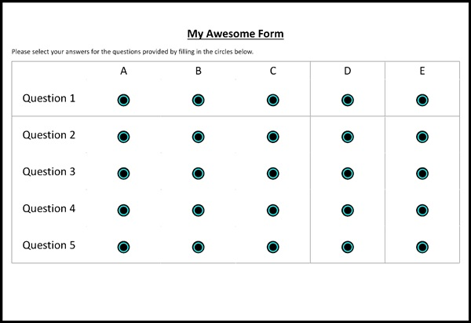

Getting Started
===============

Installation 
-------------

Install the formpy library with pip or your favourite package manager:

.. code-block:: python
    
    pip install formpy-omr

Creating a template
-------------------

Create a template in docs, word, excel or whatever your comfortable using, it needs to be converted into an image before formpy can use it.
You must ensure that there is a border on your template so that formpy can align the page for both the template, and the form when it parses the results.
Otherwise the coordinates for the answers will be off and it will not detect the answers correctly.

You can also download a template from the `formpy website <https://formpy.ismailmo.com/starter-doc/>`_

If you'd like to use the ``Template.from_img_template`` class method to instantiate a template, 
as opposed to manually writing the x,y coordinates of each spot, 
then you should prepare a template with all the answers filled in as show below:

.. image:: _static/starter-template.jpg
   :alt: starter form from the link
   :align: center
   :target: https://formpy.ismailmo.com/starter-doc

Since there are other circle-like shapes on the form, it's best to visualise which answers are detected before trying to
automatically instantiate a template. We can use ``find_spots`` to grab a list of detected answer locations.

.. code-block:: python
    
    import cv2
    from formpy.utils.template_definition import find_spots
    from formpy.utils.img_processing import process_img
    
    template_img = cv2.imread("path-to-template.jpg")
    aligned_img = process_img(template_img)

    # use min radius to ensure other circle-like shapes are not detected
    answer_locations = formpy.utils.find_spots(aligned_img,
                                                min_radius=20)

    # visualise the answers on the template image
    colour_img = cv2.cvtColor(aligned_img, cv2.COLOR_GRAY2BGR)

    for answer in answer_locations:
        colour_img=cv2.circle(colour_img, 
                                (answer[0],answer[1]), 
                                25, 
                                (0,0,255),
                                3)

    #write the output to a file - you can also use cv2.imshow 
    cv2.imwrite("template_answers.jpeg", colour_img)

Once you have confirmed the answer circles are detected correctly, you 
can create a dictionary to map the answers to questions so a template can be instantiated.
The keys must be integers and the values should be a list of answers indices returned from ``find_spots``.

.. code-block:: python

    question_assignment = {
        0: list(range(0,5)),
        1: list(range(5,10)),
        2: list(range(10,15)),
        3: list(range(15,20)),
        4: list(range(20,25))
    }

We can now instantiate the template from the image template.

.. code-block:: python

    from formpy.template import Template

    template = Template.from_img_template("path-to-template.jpg",
        circle_radius=25,
        question_assignment=question_assignment,
    )

The template can be serialised and saved into a json file so that we can 
reuse it later when reading in forms.

.. code-block:: python
    
    json_string = template.to_json()
    
    with open("json-path.json", "w+") as f:
        f.write(json_string)

Loading a template
------------------

The process for creating templates is quite tedious, so formpy provides 
methods to read and write templates from json files. We saw how to write 
to json above, loading is as simple as using ``Template.from_json``.

.. code-block:: python

    template = Template.from_json(
        "json-path.json",
        "path-to-template.jpg",
    )

Reading forms
-------------
Once you have collected your completed forms you can started reaping 
the rewards from the efforts in defining the templates.

Convert all your forms into images, there are plenty of 
`tools out there <https://www.google.com/search?q=pdf+to+image/>`_
that do this for free.

.. code-block:: python

    from formpy.form import Form

    form_img = cv2.imread("path-to-form.jpg")
    form = Form(form_img, template)

    qn_ans = {}

    # map question to marked answer(s)
    for qn in form.questions:
        qn_ans[qn] = qn.find_answers(form.img)

    # map question to marked answer value(s)
    qn_ans_vals = {
        qn.question_id: [ans.value for ans in answers]
        for (qn, answers) in qn_ans.items()
    }

From this point it is then trivial to export loop over all the forms using this pattern and 
exporting to another format, e.g. a ``pandas.DataFrame`` for data processing/analysis.

An easier way
--------------
If you do not require programmatic access to the formpy api and/or you'd like non-coders to 
create templates and read forms, check out `our website <https://formpy.ismailmo.com>`_ 
where you can replicate all this functionality via a web GUI interface and create your 
own account to save templates.

