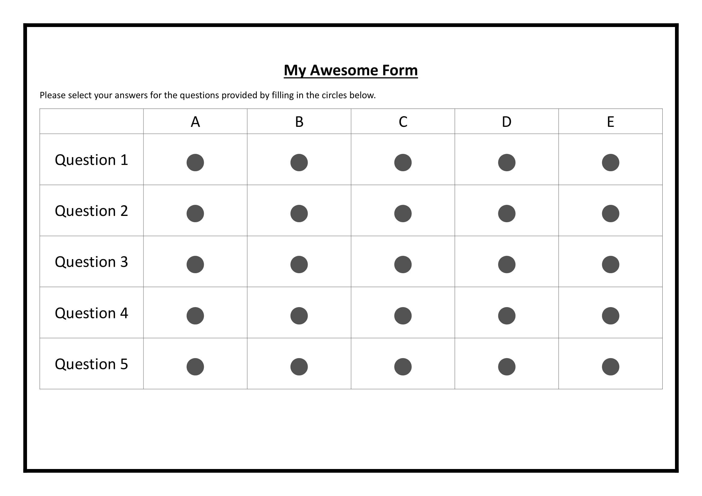

Getting Started
===============

Installation 
-------------

Install the formpy library with pip or your favourite package manager:

.. code-block:: python
    
    pip install formpy

Creating a template
-------------------

Create a template in docs, word, excel or whatever your comfortable using, it needs to be converted into an image before formpy can use it.
You must ensure that there is a border on your template so that formpy can align the page for both the template, and the form when it parses the results.
Otherwise the coordinates for the answers will be off and it will not detect the answers correctly.

You can also download a template from the `formpy website <https://formpy.ismailmo.com/starter-doc/>`_

If you'd like to use the ``find_spots`` functionality, as opposed to manually writing the x,y coordinates of each spot, then you should prepare a template with all the answers filled in as show below:

.. code-block:: python
    
    import cv2
    import formpy

    template_img = cv2.imread("path-to-template.jpg")
    answer_locations = formpy.utils.find_spots(template_img)
